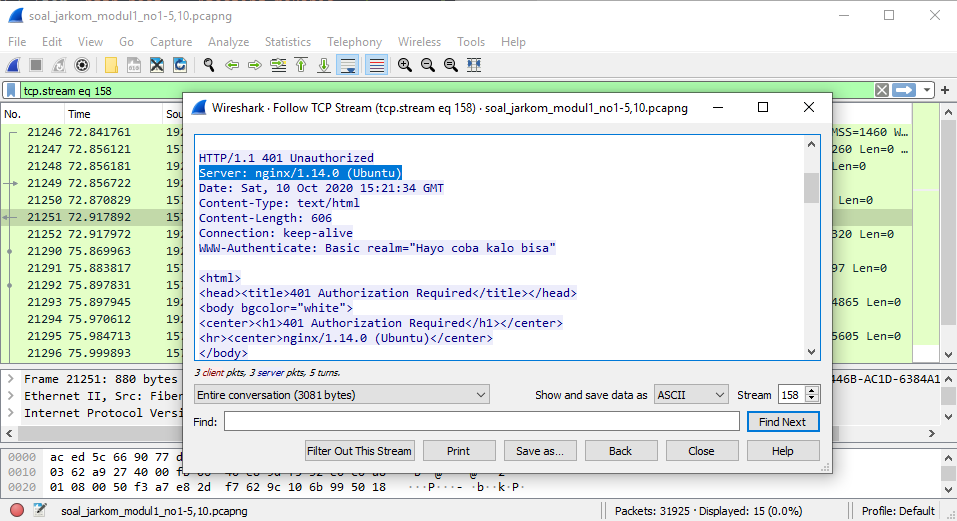

# Laporan Resmi Modul 1

## Display Filter

### Soal 1
**Sebutkan webserver yang digunakan pada "testing.mekanis.me"**\
Dengan menggunakan display filter `http.host == "testing.mekanis.me"`, akan terlihat paket-paket data yang berasal/menuju dari web testing.mekanis.me. Pilih salah satu paket data dan follow TCP stream-nya untuk melihat atribut web.

> `http.host` menampilkan paket-paket data dari dan menuju sebuah website atau IP

Di TCP stream, terlihat bahwa webserver yang digunakan website ini adalah nginx.

### Soal 2
**Simpan gambar "Tim_Kunjungan_Kerja_BAKN_DPR_RI_ke_Sukabumi141436.jpg"!**\
Tanpa menggunakan display filter, pilih menu File > Export Objects > HTTP dan ketikkan nama file di kolom Text Filter. Kemudian klik file dan Save.

### Soal 3
**Cari username dan password ketika login di "ppid.dpr.go.id"!**\
Gunakan display filter `http.host == "ppid.dor.go.id" && http.request.uri contains "login" && http.request.method == POST`. Kemudian di kolom tracing HTML Form terdapat informasi username dan password yang di-submit.

> `http.host` menampilkan paket-paket data dari dan menuju sebuah website atau IP
> `http.request.uri contains X` menampilkan paket-paket data yang path URI-nya mengandung X
> `http.request.method == X` menampilkan paket-paket data yang menggunakan method X (biasanya GET untuk menerima data atau POST saat mengirim data)

### Soal 4
**Temukan paket dari web-web yang menggunakan basic authentication method!**
Gunakan display filter `http.authbasic`. Untuk memastikan, dapat melihat atribut Authorization di HTTP trace-nya, apakah terdapat kata 'Basic' atau tidak.

> `http.authbasic` akan menampilkan paket-paket data yang diakses dari host dengan basic authentication

### Soal 5
**Ikuti perintah di aku.pengen.pw! Username dan password bisa didapatkan dari file .pcapng!**
Saat membuka aku.pengen.pw, kita diminta untuk memasukkan username dan password. Untuk itu, cari username dan password yang dimaksud dengan memberi display filter `http.host == "aku.pengen.pw` di file pcapng soal dan pilih salah satu paket data yang memiliki atribut Authorization di HTTP trace-nya. Didapat string "kakakgamtenk:hartatahtabermuda" di Credentials yang diasumsikan sebagai pasangan username dan password yang dimasukkan ke kolom isian yang muncul sebagai pop up saat mengakses aku.pengen.pw.

### Soal 6

### Soal 7

### Soal 8

### Soal 9

### Soal 10

## Capture Filter

### Soal 11
**Filter sehingga wireshark hanya mengambil paket yang mengandung port 21!**
Capture filter: `port 21`

### Soal 12
**Filter sehingga wireshark hanya mengambil paket yang berasal dari port 80!**
Capture filter: `src port 80`

### Soal 13
**Filter sehingga wireshark hanya menampilkan paket yang menuju port 443!**
Capture filter: `dst port 443`

### Soal 14
**Filter sehingga wireshark hanya mengambil paket yang berasal dari IP kalian!**
Capture filter: `src host [192.168.100.252]` (sesuaikan dengan private IP device)

> Untuk mencari tahu private IP, jalankan command "config" atau ekuivalennya (Windows Command Prompt: `ipconfig`) di CLI

### Soal 15
**Filter sehingga wireshark hanya mengambil paket yang tujuannya ke monta.if.its.ac.id!**
Capture filter: dst host `monta.if.its.ac.id`
