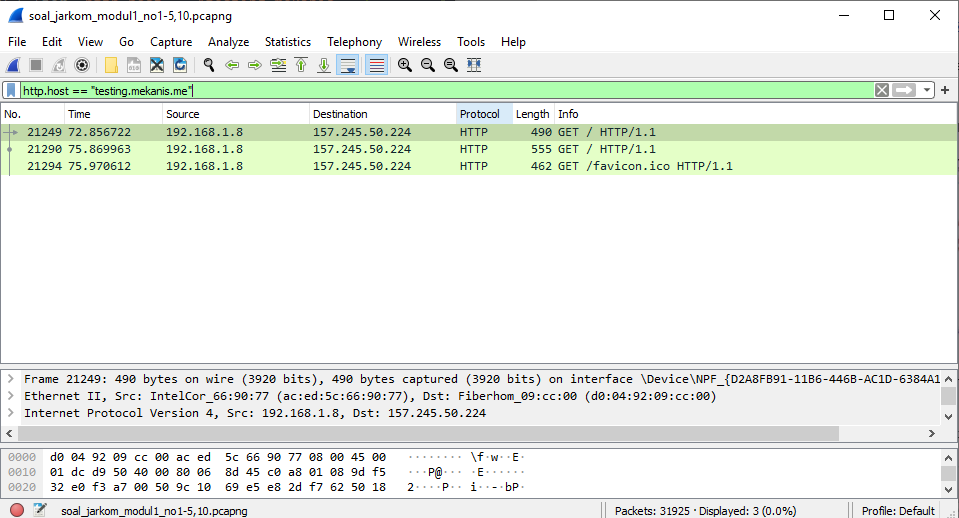
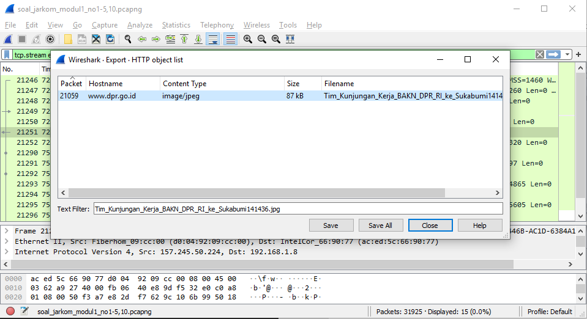
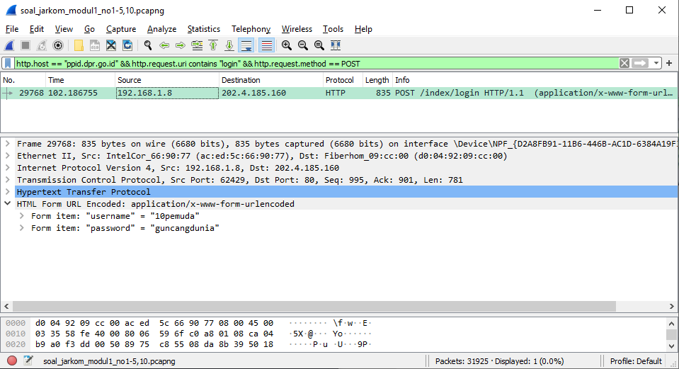
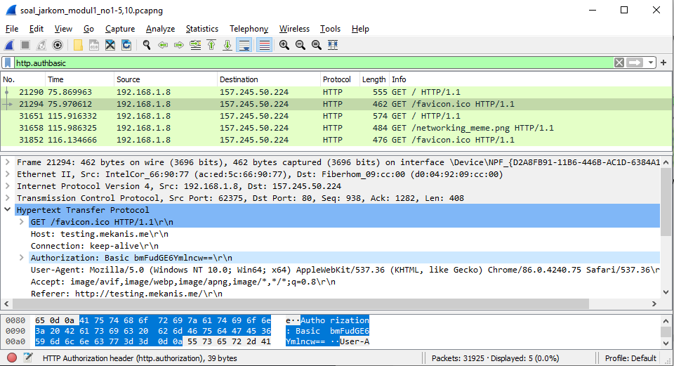
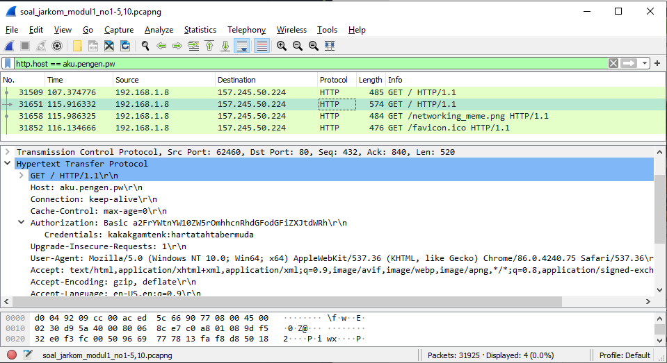
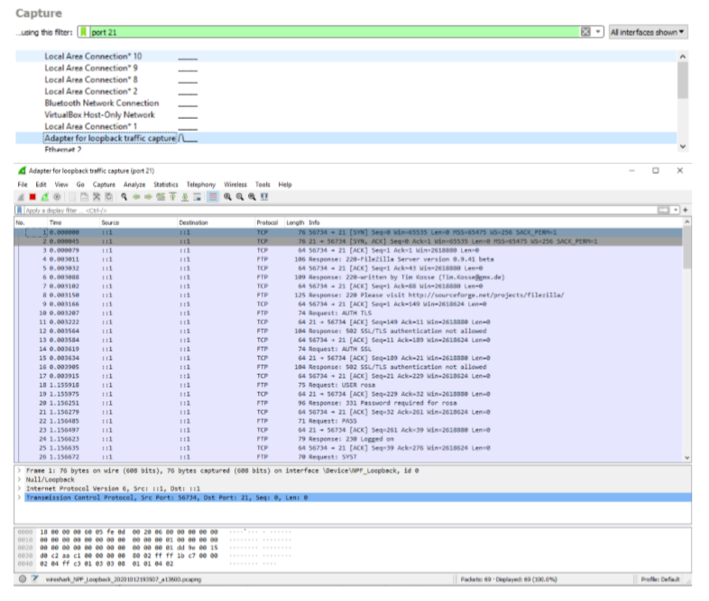
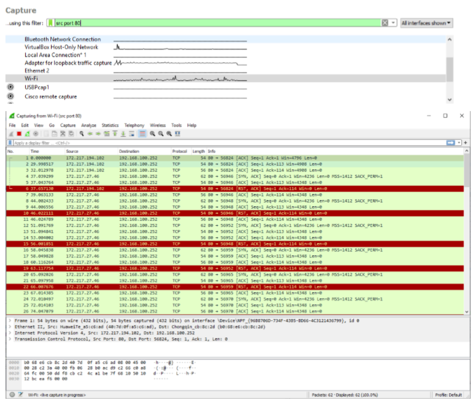
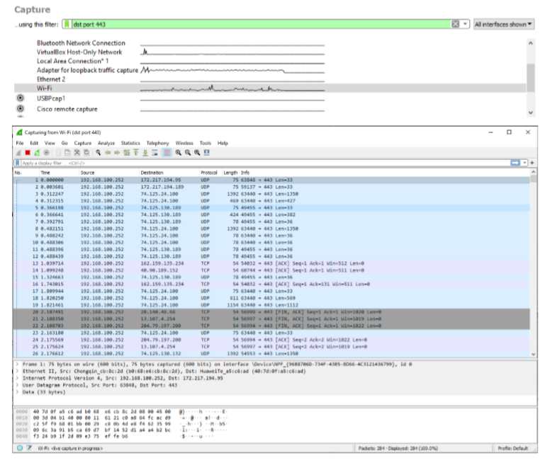
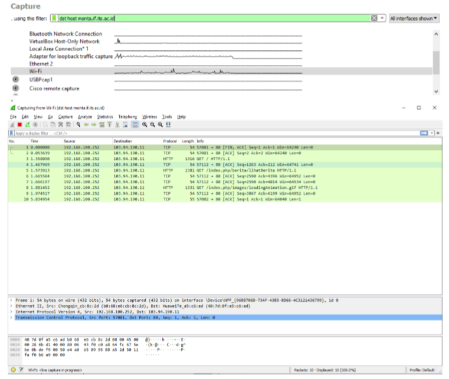

# Laporan Resmi Modul 1

  

## Display Filter

  

### Soal 1

**Sebutkan webserver yang digunakan pada "testing.mekanis.me"**\

Dengan menggunakan display filter `http.host == "testing.mekanis.me"`, akan terlihat paket-paket data yang berasal/menuju dari web testing.mekanis.me. Pilih salah satu paket data dan follow TCP stream-nya untuk melihat atribut web.\

> `http.host` menampilkan paket-paket data dari dan menuju sebuah website atau IP

  

Di TCP stream, terlihat bahwa webserver yang digunakan website ini adalah nginx.

  

### Soal 2

**Simpan gambar "Tim_Kunjungan_Kerja_BAKN_DPR_RI_ke_Sukabumi141436.jpg"!**\

Tanpa menggunakan display filter, pilih menu File > Export Objects > HTTP dan ketikkan nama file di kolom Text Filter. Kemudian klik file dan Save.\

  

### Soal 3

**Cari username dan password ketika login di "ppid.dpr.go.id"!**\

Gunakan display filter `http.host == "ppid.dor.go.id" && http.request.uri contains "login" && http.request.method == POST`. Kemudian di kolom tracing HTML Form terdapat informasi username dan password yang di-submit.\

> `http.host` menampilkan paket-paket data dari dan menuju sebuah website atau IP

> `http.request.uri contains X` menampilkan paket-paket data yang path URI-nya mengandung X

> `http.request.method == X` menampilkan paket-paket data yang menggunakan method X (biasanya GET untuk menerima data atau POST saat mengirim data)

  

### Soal 4

**Temukan paket dari web-web yang menggunakan basic authentication method!**

Gunakan display filter `http.authbasic`. Untuk memastikan, dapat melihat atribut Authorization di HTTP trace-nya, apakah terdapat kata 'Basic' atau tidak.

> `http.authbasic` akan menampilkan paket-paket data yang diakses dari host dengan basic authentication

  

### Soal 5

**Ikuti perintah di aku.pengen.pw! Username dan password bisa didapatkan dari file .pcapng!**

Saat membuka aku.pengen.pw, kita diminta untuk memasukkan username dan password. Untuk itu, cari username dan password yang dimaksud dengan memberi display filter `http.host == "aku.pengen.pw` di file pcapng soal dan pilih salah satu paket data yang memiliki atribut Authorization di HTTP trace-nya. Didapat string "kakakgamtenk:hartatahtabermuda" di Credentials yang diasumsikan sebagai pasangan username dan password yang dimasukkan ke kolom isian yang muncul sebagai pop up saat mengakses aku.pengen.pw.\

  

### Soal 6

**Seseorang menyimpan file zip melalui FTP dengan nama "Answer.zip". Simpan dan Buka file "Open This.pdf" di Answer.zip. Untuk mendapatkan password zipnya, temukan dalam file zipkey.txt (passwordnya adalah isi dari file txt tersebut).**

Hal pertama yang harus dilakukan adalah mencari file answer.zip dan zipkey.txt, untuk mencari kedua file tersebut digunakan perintah display picture "ftp-data.command contains "nama file"".

yang pertama adalah mencari Answer.zip menggunakan ftp-data.command contains "Answer.zip", lalu keluar file yang dicari seperti gambar dibawah:

Untuk menyimpan file, klik kanan pada Answer.zip lalu follow tcp stream. Save data as raw dan ganti extension file tersebut sesuai dengan extension aslinya.

Untuk mencari password dari Answer.zip, kita perlu mencari zipkey.txt. kita menggunakan ftp-data.command contains "zipkey.txt", lalu follow tcp stream. 

Karena file zipkey mempunyai extension txt, maka kita bisa langsung melihat isi dari file tersebut yang berupa password.

Setelah mendapat Answer.zip dan passwordnya, kita extract zip tersebut lalu didapatkan file Open this.pdf yang dicari.

> `ftp-data.command contains "X"` akan menampilkan paket-paket data dengan protokol FTP-DATA yang memiliki file X.

### Soal 7

**Ada 500 file zip yang disimpan ke FTP Server dengan nama 1.zip, 2.zip, ..., 500.zip. Salah satunya berisi pdf yang berisi puisi. Simpan dan Buka file pdf tersebut. Your Super Mega Ultra Rare Hint = nama pdf-nya "Yes.pdf"**

Untuk mencari zip yang berisi Yes.pdf dapat digunakan perintah display filter "ftp-data contains "Yes.pdf"", maka ditemukan zip yang berisi Yes.pdf yaitu 473.zip.

Setelah itu follow tcp stream dan simpan file seperti yang sudah dilakukan pada soal nomor 6, lalu kita dapat melihat isi dali Yes.pdf yang berisi puisi.

> `ftp-data contains "X"` akan menampilkan paket-paket data yang memiliki file X.

### Soal 8

**Cari objek apa saja yang didownload (RETR) dari koneksi FTP dengan Microsoft FTP Service!**

Untuk mencari objek yang didownload dengan Microsoft FTP Service, hal pertama yang dilakukan adalah mencari ip yang digunakan Microsoft FTP Service menggunakan perintah display filter "ftp contains "Microsoft FTP Service"".

Setelah didapat ip dari Microsoft FTP Service, kita cari file RETR yang menggunakan Microsoft FTP Service dengan perintah display filter "ftp.request.command contains "RETR" && ip.addr == 198.246.117.106"

> `ftp contains "X"` akan menampilkan paket-paket data yang memiliki data X.
> `ftp.request.command contains "X"` akan menampilkan paket-paket data yang memiliki command X.
> `ip.addr == X` akan menampilkan paket-paket yang memiliki ip address X.
  

### Soal 9

**Cari username dan password ketika login FTP pada localhost!**

Untuk mencari username dan password saat login FTP pada localhost, dapat digunakan perintah display filter "ftp.request.command == USER || ftp.request.command == PASS".

> `ftp.request.command == "X"` akan menampilkan paket-paket dengan protokol FTP yang memiliki X.

### Soal 10

**Cari file .pdf di wireshark lalu download dan buka file tersebut! clue: "25 50 44 46"**

Untuk mencari file.pdf, dapat digunakan perintah display filter "frame contains ".pdf". Selanjutnya, gunakan find package untuk mencari file.pdf dengan menggunakan clue. Masukan clue dan cari berdasarkan hex value.

Setelah itu follow tcp stream dan save seperti langkah pada nomor 6 dan 7, file pdf yang dicari merupakan file pdf yang berisi undang-undang Republik Indonesia.

  
  > `ftp contains "X"` akan menampilkan paket-paket data yang memiliki data X.

## Capture Filter

  

### Soal 11

**Filter sehingga wireshark hanya mengambil paket yang mengandung port 21!**\

Capture filter: `port 21`\

  

### Soal 12

**Filter sehingga wireshark hanya mengambil paket yang berasal dari port 80!**\

Capture filter: `src port 80`\

  

### Soal 13

**Filter sehingga wireshark hanya menampilkan paket yang menuju port 443!**\

Capture filter: `dst port 443`\

  

### Soal 14

**Filter sehingga wireshark hanya mengambil paket yang berasal dari IP kalian!**\

Capture filter: `src host [192.168.100.252]` (sesuaikan dengan private IP device)\

> Untuk mencari tahu private IP, jalankan command "config" atau ekuivalennya (Windows Command Prompt: `ipconfig`) di CLI

  

### Soal 15

**Filter sehingga wireshark hanya mengambil paket yang tujuannya ke monta.if.its.ac.id!**\

Capture filter: dst host `monta.if.its.ac.id`\

 