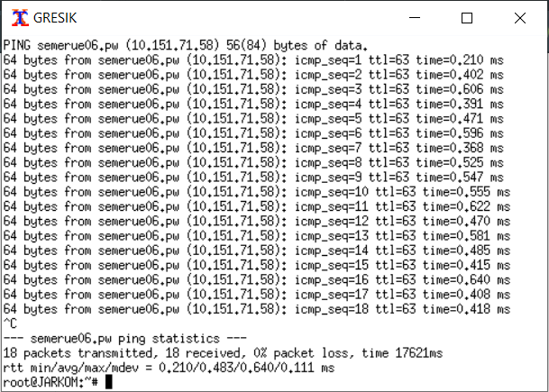
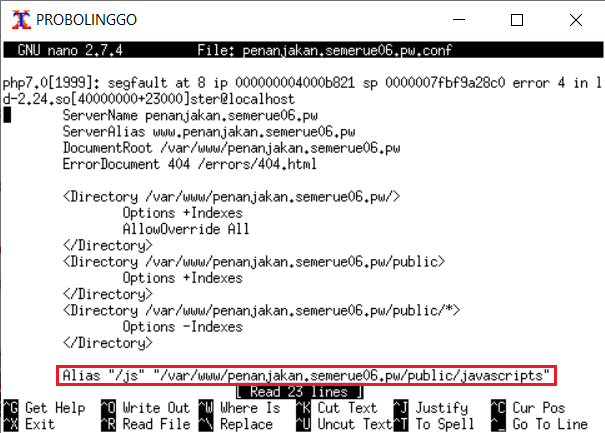
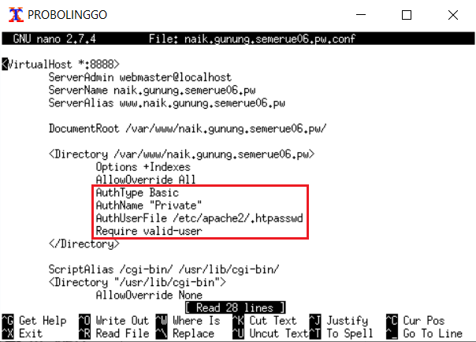

# Laporan Resmi Modul 2 

### Soal 1

**Membuat sebuah website dengan alamat **http://semerue06.pw****

**Pada UML MALANG**

 - Install bind9 pada UML MALANG dengan mengetik `apt-get install bind9 -y`.
 - Lakukan pengaturan pada `/etc/bind/named.conf.local`.
 - Tambahkan kode dibawah :

       zone "semerue06.pw" {
            type master;
            notify yes;
            also-notify { 10.151.71.59; };
            allow-transfer { 10.151.71.59; };
            file "/etc/bind/jarkom/semerue06.pw";
       };
       
      
      
 - Buat folder baru dengan cara mkdir `/etc/bind/jarkom`.
 - Copy file db.local ke folder yang baru dibuat dan ganti namanya sesuai domain yang diinginkan `cp /etc/bind/db.local /etc/bind/jarkom/semerue06.pw`.
 - Buka file `semerue06.pw` menggunakan perintah `nano /etc/bind/jarkom/semerue06.pw`.

      
       
 - Restart service bind9 menggunakan perintah `service bind9 restart`.

**Pada UML GRESIK**

 - Setting nameserver pada GRESIK agar mengarah pada IP MALANG, edit file `resolv.conf` dengan mengetikkan perintah `nano /etc/resolv.conf` dan masukkan IP MALANG

      
      
 - Kemudian, untuk mengecek apakah domain  `semerue06.pw`  dapat diakses, jalankan perintah  `ping semerue06.pw`  pada UML GRESIK.
 
      

### Soal 2

**Membuat alias **http://www.semerue06.pw****

**Pada UML MALANG**

 - Jalankan perintah  `nano /etc/bind/jarkom/semerue06.pw`  lalu tambahkan perintah seperti gambar dibawah :
 
    
 
 - Restart bind9 menggunakan perintah `service bind9 restart`.

**Pada UML GRESIK**

 - Kemudian, untuk mengecek apakah domain  `www.semerue06.pw`  dapat diakses, jalankan perintah  `ping www.semerue06.pw`  pada UML GRESIK.

    

### Soal 3

****Membuat subdomain http://penanjakan.semerue06.pw yang diatur DNS-nya pada MALANG dan mengarah ke IP Server PROBOLINGGO****

**Pada UML MALANG**

 - Jalankan perintah  `nano /etc/bind/jarkom/semerue06.pw`  lalu tambahkan perintah seperti gambar dibawah :
 
    
 
 - Restart bind9 menggunakan perintah `service bind9 restart`.

**Pada UML GRESIK**

 - Kemudian, untuk mengecek apakah domain  `penanjakan.semerue06.pw`  dapat diakses, jalankan perintah  `ping penanjakan.semerue06.pw`  pada UML GRESIK.

    
  
### Soal 4

**Membuat reverse domain untuk domain utama**

**Pada UML MALANG**

 - Edit file /etc/bind/named.conf.local dengan perintah  `nano /etc/bind/named.conf.local`, lalu menambahkan konfigurasi seperti pada gambar :
 
     
     
 - Copy file db.local menggunakan perintah `cp /etc/bind/db.local /etc/bind/jarkom/71.151.10.in-addr.arpa`, lalu edit seperti gambar dibawah ini :
 
    

 - Restart bind9 menggunakan perintah `service bind9 restart`.
 
 **Pada UML GRESIK**
  - Kemudian, untuk mengecek apakah konfigurasi sudah benar, jalankan perintah  `host -t PTR 10.151.71.58`  pada UML GRESIK.
  
    

### Soal 5

**Membuat DNS Server Slave pada MOJOKERTO**

**Pada UML MALANG**

 - Edit file  `/etc/bind/named.conf.local`  menjadi :
 
    

 - Restart bind9 menggunakan perintah `service bind9 restart`.
 
 **Pada UML MOJOKERTO**

 - Edit file  `/etc/bind/named.conf.local`  menjadi :
 
    

 - Restart bind9 menggunakan perintah `service bind9 restart`.
 
 **Pada UML MALANG**

-   Untuk mengecek apakah konfigurasi berhasil, maka stop service pada UML MALANG dengan perintah  `service bind9 stop`.

### Soal 6

**Membuat subdomain dengan alamat http://gunung.semerue06.pw yang didelegasikan pada server MOJOKERTO dan mengarah ke IP Server PROBOLINGGO**

**Pada UML MALANG**

 - Edit file `/etc/bind/jarkom/semerue06.pw` dan mengubah menjadi seperti di bawah ini :

    
 
 - Edit file `/etc/bind/named.conf.options` dan mengubah menjadi seperti di bawah ini :

    
 
 - Edit file `/etc/bind/named.conf.local` dan mengubah menjadi seperti di bawah ini :

    
    
  - Restart bind9 menggunakan perintah `service bind9 restart`.

**Pada UML MOJOKERTO**

 - Edit file `/etc/bind/named.conf.local` dan mengubah menjadi seperti di bawah ini :

    

 - Buat direktori dengan nama delegasi, copy db.local ke folder baru dan edit namanya menjadi `gunung.semerue06.pw`, dengan perintah :

    mkdir /etc/bind/delegasi
    cp /etc/bind/db.local /etc/bind/delegasi/gunung.semerue06.pw

 - Edit file `gunung.semerue06.pw` menjadi seperti dibawah ini :
 
   

 - Restart bind9 menggunakan perintah `service bind9 restart`.

### Soal 7

**Membuat subdomain dengan nama http://naik.gunung.semeruyyy.pw, domain ini diarahkan ke IP Server PROBOLINGGO**

**Pada UML MOJOKERTO**

- Edit file `/etc/bind/delegasi/gunung.semerue06.pw` menjadi seperti dibawah ini :
 
   

 - Restart bind9 menggunakan perintah `service bind9 restart`.

**Pada UML GRESIK**

-   Untuk mengecek apakah konfigurasi sudah benar, lakukan perintah `ping naik.gunung.semerue06.pw` :

    

### Soal 8

**Mengatur web server, Domain http://semerue06.pw memiliki DocumentRoot pada /var/www/semeruyyy.pw**

**Pada UML PROBOLINGGO**

 - Install Apache2 dan PHP5 dengan perintah `apt-get install apache2` dan `apt-get install php5`.
 - Copy file default pada directory /etc/apache2/sites-available, ubah file default menjadi menjadi file baru bernama domain yang ingin kita buat dengan command `cp default semerue06.pw`.
 - Edit file `semerue06.pw`, ubah DocumentRoot serta menambahkan ServerName dan ServerAlias seperti gambar di bawah :

    

 - Restart apache, menggunakan perintah `service apache2 restart`.
 - Pindah ke direktori `/var/www` lalu download file zip menggunakan perintah `wget 10.151.36.202/semeru.pw.zip`, lalu unzip dan rename folder menjadi `semerue06.pw`
 - Lakukan a2ensite pada `semerue06.pw` untuk enable site, lalu restart apache menggunakan perintah `service apache2 restart`

**Pada Browser**

 - Akses situs semerue06.pw pada browser
 
    
    
### Soal 9

**Pada UML PROBOLINGGO**

**Rewrite **http://semerue06.pw/index.php/home** menjadi **http://semerue06.pw/home****

 - Jalankan perintah a2enmod rewrite untuk mengaktifkan module rewrite.
 - Pindah ke directory /var/www/semerue06.pw dan buat file .htaccess dengan isi file seperti dibawah ini :

    

 - Buat `semerue06.pw.conf` di directory `/etc/apache2/sites-available`, lalu isi file tersebut seperti gambar di bawah ini :
 
   

**Pada Browser**

 - Tampilan pada browser.
 
     

### Soal 10

**http://penanjakan.semeruyyy.pw akan digunakan untuk menyimpan assets file yang
memiliki DocumentRoot pada /var/www/penanjakan.semeruyyy.pw**

Struktur folder :

    /var/www/penanjakan.semeruyyy.pw
									 /public/javascripts
									 /public/css
									 /public/images
									 /errors
									
**Pada UML PROBOLINGGO**

 - Copy file default pada directory /etc/apache2/sites-available, ubah file default menjadi menjadi file baru bernama domain yang ingin kita buat dengan command `cp default penanjakan.semerue06.pw.conf`.
 - Edit file `penanjakan.semerue06.pw.conf`, ubah DocumentRoot serta menambahkan ServerName dan ServerAlias seperti gambar di bawah :

    

 - Restart apache, menggunakan perintah `service apache2 restart`.
 - Pindah ke direktori `/var/www` lalu download file zip menggunakan perintah `wget 10.151.36.202/semeru.pw.zip`, lalu unzip dan rename folder menjadi `penanjakan.semerue06.pw`.
 - Lakukan a2ensite pada `penanjakan.semerue06.pw` untuk enable site, lalu restart apache menggunakan perintah `service apache2 restart`.

**Pada Browser**

 - Akses situs penanjakan.semerue06.pw pada browser
 
    
 
### Soal 11

****Pada folder /public dibolehkan directory listing namun untuk folder yang berada di dalamnya tidak dibolehkan****

**Pada UML PROBOLINGGO**

 - Edit file `penanjakan.semerue06.pw.conf` pada `/etc/apache2/sites-available`, tambahkan konfigurasi seperti di bawah ini :

    

**Pada Browser**

 - Akses situs penanjakan.semerue06.pw/public pada browser, maka directory listing masi bisa dilakukan.
 
    

 - Saat mengakses domain lain, directory listing tidak bisa dilakukan.

    

### Soal 12

****Untuk mengatasi HTTP Error code 404, disediakan file 404.html pada folder /errors untuk mengganti error default 404 dari Apache****

**Pada UML PROBOLINGGO**

 - Edit file `penanjakan.semerue06.pw.conf` pada `/etc/apache2/sites-available`, tambahkan konfigurasi seperti di bawah ini :

    

- Restart apache, menggunakan command `service apache2 restart`.

**Pada Browser**

 - Akses situs penanjakan.semerue06.pw/publix (typo) pada browser, maka tampilan pada browser menjadi seperti gambar di bawah :
 
    

### Soal 13

****buat konfigurasi virtual host untuk mengubah akses file assets dari **http://penanjakan.semerue06.pw/public/javascripts** menjadi http://penanjakan.semerue06.pw/js****

 - Edit file `penanjakan.semerue06.pw.conf` pada `/etc/apache2/sites-available`, tambahkan konfigurasi seperti di bawah ini :

    

**Pada Browser**

 - Akses alamat `penanjakan.semerue06.pw/js` maka browser akan menampilkan seperti gambar di bawah ini :
 
    
  
### Soal 14

**Web http://naik.gunung.semerue06.pw sudah bisa diakses hanya dengan menggunakan port 8888. DocumentRoot web berada pada /var/www/naik.gunung.semerue06.pw**

**Pada UML PROBOLINGGO**

 - Copy file default pada directory /etc/apache2/sites-available, ubah file default menjadi menjadi file baru bernama domain yang ingin kita buat dengan command `cp default naik.gunung.semerue06.pw.conf`.
 - Edit file `naik.gunung.semerue06.pw.conf`, ubah DocumentRoot serta menambahkan ServerName dan ServerAlias seperti gambar di bawah :

    

 - Restart apache, menggunakan perintah `service apache2 restart`.
 - Pindah ke direktori `/var/www` lalu download file zip menggunakan perintah `wget 10.151.36.202/semeru.pw.zip`, lalu unzip dan rename folder menjadi `naik.gunung.semerue06.pw`.
 - Aktifkan port 8888 dengan mengedit file: `nano /etc/apache2/ports.conf` menjadi :

    
    
 - Lakukan a2ensite pada `naik.gunung.semerue06.pw` untuk enable site, lalu restart apache menggunakan perintah `service apache2 restart`.

**Pada Browser**

 - Akses situs naik.gunung.semerue06.pw:8888 pada browser
 
    

### Soal 15
**Membuat web http://naik.gunung.semeruyyy.pw agar diberi autentikasi password dengan username “semeru” dan password “kuynaikgunung”**

**Pada UML PROBOLINGGO**

 - Edit file `naik.gunung.semerue06.pw.conf` pada `/etc/apache2/sites-available`, tambahkan konfigurasi seperti di bawah ini :

    

 - Jalankan perintah `htpasswd -c /etc/apache2/.htpasswd semeru` untuk membuat akun autentikasi baru dengan username **semeru**. Kita akan diminta untuk memasukkan password baru dan confirm password tersebut diisi **kuynaikgunung**.
 - Restart apache, menggunakan command `service apache2 restart`.

**Pada Browser**

 - Akses situs naik.gunung.semerue06.pw:8888 pada browser, maka akan diminta untuk memasukan username dan password :
 
    
  

### Soal 16

**Saat mengunjungi IP PROBOLINGGO akan dialihkan secara otomatis ke http://semerue06.pw**

**Pada UML PROBOLINGGO**
 - Edit file `000-default.conf` pada `/etc/apache2/sites-available`, tambahkan konfigurasi seperti di bawah ini :

    

**Pada Browser**

 - Akses IP PROBOLINGGO pada browser, maka yang ditampilkan adalah semerue06.pw :
 
    
  
### Soal 17

**Arahkan semua request gambar yang memiliki substring “semeru” menuju semeru.jpg**

**Pada UML PROBOLINGGO**

 - Buat file `.htaccess` pada `/var/www/penanjakan.semerue07.pw`, tambahkan konfigurasi seperti di bawah ini :

    

**Pada Browser**

 - Ketika mengakses penanjakan.semerue06.pw/public/images/bukansemeruaja.jpg maka akan langsung diarahkan ke penanjakan.semerue06.pw/public/images/semeru.jpg.
 
    