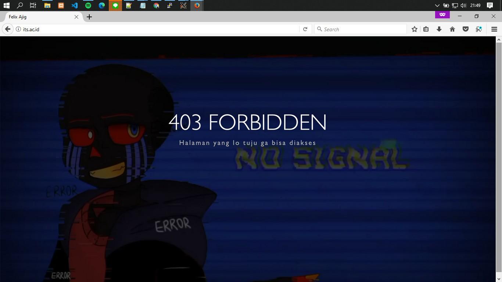

# Laporan Resmi Modul 3 

## Soal 1

**Membuat topologi berdasarkan gambar dibawah**

  

- Membuat switch
  ```
  # Switch
  uml_switch -unix switch1 > /dev/null < /dev/null &
  uml_switch -unix switch2 > /dev/null < /dev/null &
  uml_switch -unix switch3 > /dev/null < /dev/null &
  ```

- Menjadikan SURABAYA sebagai router
  ```
  # Router
  xterm -T SURABAYA -e linux ubd0=SURABAYA,jarkom umid=SURABAYA eth0=tuntap,,,10.151.70.29 eth1=daemon,,,switch1 eth2=daemon,,,switch3 eth3=daemon,,,switch2 mem=256M &
  ```
- Menjadikan MALANG, MOJOKERTO, dan TUBAN sebagai server
  ```
  # Server
  xterm -T MALANG -e linux ubd0=MALANG,jarkom umid=MALANG eth0=daemon,,,switch2 mem=160M &
  xterm -T MOJOKERTO -e linux ubd0=MOJOKERTO,jarkom umid=MOJOKERTO eth0=daemon,,,switch2 mem=128M &
  xterm -T TUBAN -e linux ubd0=TUBAN,jarkom umid=TUBAN eth0=daemon,,,switch2 mem=128M &
  ```
- Menjadikan GRESIK,SIDOARJO,BANYUWANGI, dan MADIUN sebagai client
  ```
  # Klien
  xterm -T SIDOARJO -e linux ubd0=SIDOARJO,jarkom umid=SIDOARJO eth0=daemon,,,switch1 mem=64M &
  xterm -T GRESIK -e linux ubd0=GRESIK,jarkom umid=GRESIK eth0=daemon,,,switch1 mem=64M &
  xterm -T BANYUWANGI -e linux ubd0=BANYUWANGI,jarkom umid=BANYUWANGI eth0=daemon,,,switch1 mem=64M &
  xterm -T MADIUN -e linux ubd0=MADIUN,jarkom umid=MADIUN eth0=daemon,,,switch1 mem=64M &
  ```
- Masukan semua sintaks diatas kedalam topologi.sh dengan menggunakan perintah nano ```topologi.sh```
  
  

- Bash topologi.sh dan lakukan setting sysctl pada SURABAYA 

  Jalankan perintah ```nano /etc/sysctl.conf```, hilangkan tanda pagar pada ```net.ipv4.    ip_forward=1```.

  

  Jalankan perintah ```sysctl -p``` untuk mengaktifkan perubahan.

  

- Atur interfaces pada setiap uml

  **UML SURABAYA**
  ```
  auto lo
  iface lo inet loopback

  auto eth0
  iface eth0 inet static
  address 10.151.70.30
  netmask 255.255.255.252
  gateway 10.151.70.29

  auto eth1
  iface eth1 inet static
  address 192.168.0.1
  netmask 255.255.255.248

  auto eth2
  iface eth2 inet static
  address 192.168.1.1
  netmask 255.255.255.0

  auto eth3
  iface eth3 inet static
  address 10.151.71.57
  netmask 255.255.255.0
  ```
  

  **UML TUBAN**
  ```
  auto lo
  iface lo inet loopback

  auto eth0
  iface eth0 inet static
  address 10.151.71.60
  netmask 255.255.255.248
  gateway 10.151.71.57
  ```
  

  **UML MOJOKERTO**
  ```
  auto lo
  iface lo inet loopback

  auto eth0
  iface eth0 inet static
  address 10.151.71.59
  netmask 255.255.255.248
  gateway 10.151.71.57
  ```
  

  **UML MALANG**
  ```
  auto lo
  iface lo inet loopback

  auto eth0
  iface eth0 inet static
  address 10.151.71.58
  netmask 255.255.255.248
  gateway 10.151.71.57
  ```
  

  **UML GRESIK**
  ```
  auto lo
  iface lo inet loopback

  auto eth0
  iface eth0 inet dhcp
  ```
  

  **UML SIDOARJO**
  ```
  auto lo
  iface lo inet loopback

  auto eth0
  iface eth0 inet dhcp
  ```
  

  **UML BANYUWANGI**
  ```
  auto lo
  iface lo inet loopback

  auto eth0
  iface eth0 inet dhcp
  ```
  

  **UML MADIUN**
  ```
  auto lo
  iface lo inet loopback

  auto eth0
  iface eth0 inet dhcp
  ```
  
  
## Soal 2

## Soal 3

## Soal 4

## Soal 5

## Soal 6

## Soal 7

**User authentication untuk Anri**

- Pada UML Mojokerto (proxy server) install squid dan apache2-utils
  ```
  apt-get install squid
  apt-get install apache2-utils
  ```
- Setup username dan password\
  User: userta_e06\
  Password: inipassw0rdta_e06
  ```
  htpasswd -c /etc/squid/passwd userta_e06
  ```
  
  
- Ubah konfigurasi squid
  ```
  nano /etc/squid/squid.conf
  ```
  ```
  http_port 8080
  visible_hostname mojokerto

  auth_param basic program /usr/lib/squid/basic_ncsa_auth /etc/squid/passwd
  auth_param basic children 5
  auth_param basic realm Proxy
  auth_param basic credentialsttl 2 hours
  auth_param basic casesensitive on
  acl USERS proxy_auth REQUIRED
  http_access allow USERS
  ```
  
## Soal 8 dan 9

**Filtering jadwal pengaksesan**

- Mendefinisikan jadwal yang tidak restricted. Dalam soal 8 dan 9, yang tidak restricted adalah:
  + Selasa 13:00 - 18:00, 21:00 - 23:59
  + Rabu 00:00 - 09:00, 13:00 - 18:00, 21:00 - 23:59
  + Kamis 00:00 - 09:00, 21:00 - 23:59
  + Jumat 00:00 - 09:00
  
  

- Menambah konfigurasi squid
  ```
  nano /etc/squid/squid.conf
  ```
  ```
  include /etc/squid/acl.conf
  http_access allow work 
  http_access allow bimbingan1
  http_access allow bimbingan2
  http_access deny all
  ```
  
## Soal 10

**Redirect ke monta.if.its.ac.id setiap mengakses google.com**

- Mendefinisikan google.com sebagai website restricted
  ```
  nano /etc/squid/restrict-sites.acl
  ```
  ```
  google.com
  ```

- Menambah konfigurasi squid
  ```
  acl BLACKLISTS dstdomain "/etc/squid/restrict-sites.acl"
  deny_info http://monta.if.its.ac.id BLACKLISTS
  http_access deny BLACKLISTS
  ```

## Soal 11

**Mengganti error page default squid**

- Mendownload page ke directory error template dan extract isinya
  ```
  cd /usr/share/squid/errors
  wget 10.151.36.202/error403.tar.gz
  tar -xvf error403.tar.gz
  ```
- Meng-copy isi /usr/share/squid/errors/template ke /usr/share/squid/errors/error403
  ```
  cp template/* error403
  ```
- Mengganti /usr/share/squid/errors/error403/ERR_ACCESS_DENIED dengan /usr/share/squid/errors/error403/error403.html
  ```
  mv error403/error403.html error403/ERR_ACCESS_DENIED
  ```
- Memindahkan /usr/share/squid/errors/error403/error.jpg ke /usr/share/squid/icons
  ```
  mv error403/error.jpg ../../icons
  ```
- Mengubah directory background image di stylesheet error403/ERR_ACCESS_DENIED
  ```
  body {
    background: url('/squid-internal-static/icons/error.jpg');
  }
  ```
- Menambah konfigurasi squid
  ```
  error_directory /usr/share/squid/errors/error403/
  icon_directory /usr/share/squid/icons/
  ```
  
  
  
  **Catatan**: Dari inspect page, halaman yang ditampilkan sudah benar, namun image tidak dapat ditampilkan.

## Soal 12
