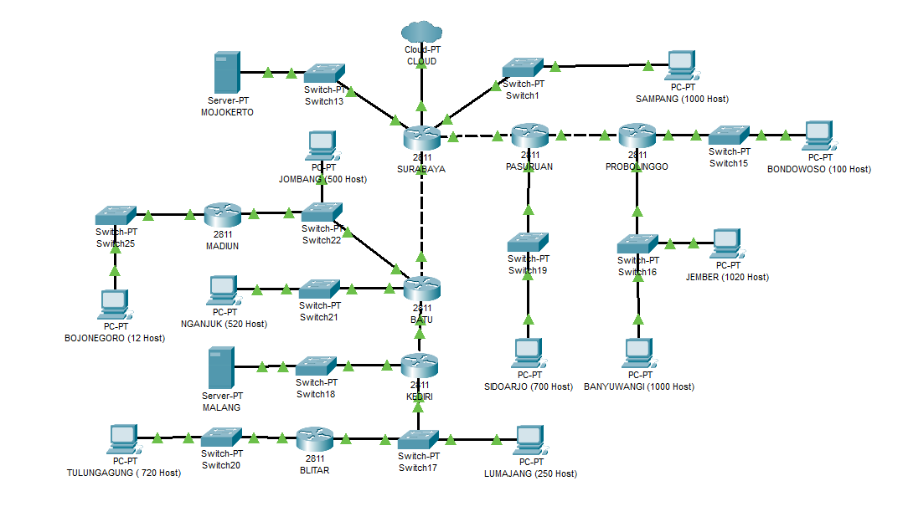
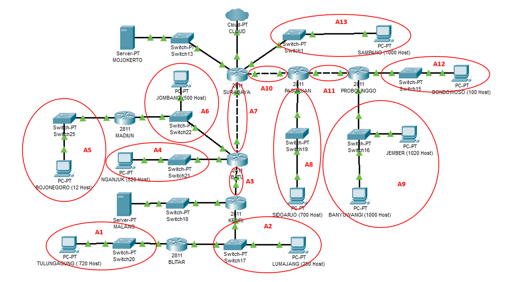

# Laporan Resmi Modul 4 

## TOPOLOGI

**VLSM - CISCO**

- Pembagian subnet

  

- Perhitungan subnet

  | Subnet | Jumlah IP | Netmask |
  |--|--|--|
  | A1 | 721 | /22 |
  | A2 | 252 | /24 |
  | A3 | 2 | /30 |
  | A4 | 521 | /22 |
  | A5 | 13 | /28 |
  | A6 | 502 | /23 |
  | A7 | 2 | /30 |
  | A8 | 701 | /22 |
  | A9 | 2021 | /21 |
  | A10 | 2 | /30 |
  | A11 | 2 | /30 |
  | A12 | 101 | /25 |
  | A13 | 1001 | /22 |
  | **Total** | **5841** | **/19** |

- VLSM Tree

  

- Pembagian IP

  | Subnet | Jumlah IP | Length | NID | Submask |
  |--|--|--|--|--|
  | A1 | 721 | /22 | 192.168.16.0 | 255.255.252.0 |
  | A2 | 252 | /24 | 192.168.1.0 | 255.255.255.0 |
  | A3 | 2 | /30 | 192.168.0.0 | 255.255.255.252 |
  | A4 | 521 | /22 | 192.168.12.0 | 255.255.252.0 |
  | A5 | 13 | /28 | 192.168.0.16 | 255.255.255.240 |
  | A6 | 502 | /23 | 192.168.2.0 | 255.255.254.0 |
  | A7 | 2 | /30 | 192.168.0.4 | 255.255.255.252 |
  | A8 | 701 | /22 | 192.168.8.0 | 255.255.252.0 |
  | A9 | 2021 | /21 | 192.168.24.0 | 255.255.248.0 |
  | A10 | 2 | /30 | 192.168.0.8 | 255.255.255.252 |
  | A11 | 2 | /30 | 192.168.0.12 | 255.255.255.252 |
  | A12 | 101 | /25 | 192.168.0.128 | 255.255.255.128 |
  | A13 | 1001 | /22 | 192.168.4.0 | 255.255.252.0 |

- Routing

  | Router | Subnet | NID | Netmask | Next Hop |
  |--|--|--|--|--|
  | **SURABAYA** | 11 |	192.168.0.12 | 255.255.255.252 | 192.168.0.10 |
  | | 12 | 192.168.0.128   | 255.255.255.128 | 192.168.0.10 |
  | | 9	| 192.168.24.0    | 255.255.248.0   | 192.168.0.10 |
  | | 8	| 192.168.8.0     | 255.255.252.0   | 192.168.0.10 |
  | | 3	| 192.168.0.0     | 255.255.255.252	| 192.168.0.6 |
  | | 2	| 192.168.1.0     | 255.255.255.0	| 192.168.0.6 |
  | | 1	| 192.168.16.0    | 255.255.252.0	| 192.168.0.6 |
  | | 4	| 192.168.12.0	  | 255.255.252.0	| 192.168.0.6 |
  | | 6	| 192.168.2.0     | 255.255.254.0	| 192.168.0.6 |
  | | 5	| 192.168.0.16	  | 255.255.255.240	| 192.168.0.6 |
  | | MALANG | 10.151.71.60 | 255.255.255.252 | 192.168.0.6 |
  | **PASURUAN** | 12 | 192.168.0.128 | 255.255.255.128 | 192.168.0.14 |
  | | 9 | 192.168.24.0 | 255.255.248.0 | 192.168.0.14 |
  | | 0 | 0.0.0.0 | 0.0.0.0 | 192.168.0.9 |
  | **PROBOLINGGO** | 0 0.0.0.0 | 0.0.0.0 | 192.168.0.13 |
  | **BATU** | 0 0.0.0.0 | 0.0.0.0 | 192.168.0.5 |
  | | 2 | 192.168.1.0 | 255.255.255.0 | 192.168.0.2 |
  | | 1 | 192.168.16.0 | 255.255.252.0 | 192.168.0.2 |
  | | 5 | 192.168.0.16 | 255.255.255.240 | 192.168.2.3 |
  | | MALANG | 10.151.71.60 | 255.255.255.252 | 192.168.0.2 |
  | **MADIUN****** | 0 | 0.0.0.0 | 0.0.0.0 | 192.168.2.1 |
  | **KEDIRI** | 0 | 0.0.0.0 | 0.0.0.0 | 192.168.0.1 |
  | | 1 | 192.168.16.0 | 255.255.252.0 | 192.168.1.3 |
  | **BLITAR** | 0 | 0.0.0.0 | 0.0.0.0 | 192.168.1.1 |