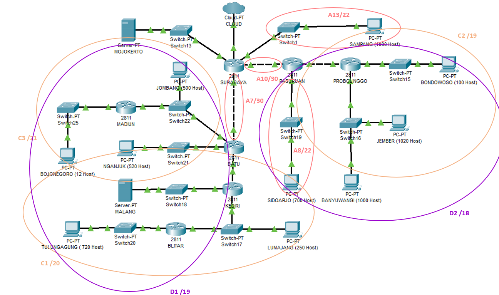

# Laporan Resmi Modul 4 

**TOPOLOGI**


# VLSM (Variable Length Subnet Masking) - Cisco Packet Tracer

## Pembagian subnet

  

## Perhitungan subnet

  | Subnet | Jumlah IP | Netmask |
  |--|--|--|
  | A1 | 721 | /22 |
  | A2 | 252 | /24 |
  | A3 | 2 | /30 |
  | A4 | 521 | /22 |
  | A5 | 13 | /28 |
  | A6 | 502 | /23 |
  | A7 | 2 | /30 |
  | A8 | 701 | /22 |
  | A9 | 2021 | /21 |
  | A10 | 2 | /30 |
  | A11 | 2 | /30 |
  | A12 | 101 | /25 |
  | A13 | 1001 | /22 |
  | **Total** | **5841** | **/19** |

## VLSM Tree

  

## Pembagian IP

  | Subnet | Jumlah IP | Length | NID | Submask |
  |--|--|--|--|--|
  | A1 | 721 | /22 | 192.168.16.0 | 255.255.252.0 |
  | A2 | 252 | /24 | 192.168.1.0 | 255.255.255.0 |
  | A3 | 2 | /30 | 192.168.0.0 | 255.255.255.252 |
  | A4 | 521 | /22 | 192.168.12.0 | 255.255.252.0 |
  | A5 | 13 | /28 | 192.168.0.16 | 255.255.255.240 |
  | A6 | 502 | /23 | 192.168.2.0 | 255.255.254.0 |
  | A7 | 2 | /30 | 192.168.0.4 | 255.255.255.252 |
  | A8 | 701 | /22 | 192.168.8.0 | 255.255.252.0 |
  | A9 | 2021 | /21 | 192.168.24.0 | 255.255.248.0 |
  | A10 | 2 | /30 | 192.168.0.8 | 255.255.255.252 |
  | A11 | 2 | /30 | 192.168.0.12 | 255.255.255.252 |
  | A12 | 101 | /25 | 192.168.0.128 | 255.255.255.128 |
  | A13 | 1001 | /22 | 192.168.4.0 | 255.255.252.0 |

## Routing

  | Router | Subnet | NID | Netmask | Next Hop |
  |--|--|--|--|--|
  | **SURABAYA** | 11 |	192.168.0.12 | 255.255.255.252 | 192.168.0.10 |
  | | 12 | 192.168.0.128   | 255.255.255.128 | 192.168.0.10 |
  | | 9	| 192.168.24.0    | 255.255.248.0   | 192.168.0.10 |
  | | 8	| 192.168.8.0     | 255.255.252.0   | 192.168.0.10 |
  | | 3	| 192.168.0.0     | 255.255.255.252	| 192.168.0.6 |
  | | 2	| 192.168.1.0     | 255.255.255.0	| 192.168.0.6 |
  | | 1	| 192.168.16.0    | 255.255.252.0	| 192.168.0.6 |
  | | 4	| 192.168.12.0	  | 255.255.252.0	| 192.168.0.6 |
  | | 6	| 192.168.2.0     | 255.255.254.0	| 192.168.0.6 |
  | | 5	| 192.168.0.16	  | 255.255.255.240	| 192.168.0.6 |
  | | MALANG | 10.151.71.60 | 255.255.255.252 | 192.168.0.6 |
  | **PASURUAN** | 12 | 192.168.0.128 | 255.255.255.128 | 192.168.0.14 |
  | | 9 | 192.168.24.0 | 255.255.248.0 | 192.168.0.14 |
  | | 0 | 0.0.0.0 | 0.0.0.0 | 192.168.0.9 |
  | **PROBOLINGGO** | 0 | 0.0.0.0 | 0.0.0.0 | 192.168.0.13 |
  | **BATU** | 0 | 0.0.0.0 | 0.0.0.0 | 192.168.0.5 |
  | | 2 | 192.168.1.0 | 255.255.255.0 | 192.168.0.2 |
  | | 1 | 192.168.16.0 | 255.255.252.0 | 192.168.0.2 |
  | | 5 | 192.168.0.16 | 255.255.255.240 | 192.168.2.3 |
  | | MALANG | 10.151.71.60 | 255.255.255.252 | 192.168.0.2 |
  | **MADIUN** | 0 | 0.0.0.0 | 0.0.0.0 | 192.168.2.1 |
  | **KEDIRI** | 0 | 0.0.0.0 | 0.0.0.0 | 192.168.0.1 |
  | | 1 | 192.168.16.0 | 255.255.252.0 | 192.168.1.3 |
  | **BLITAR** | 0 | 0.0.0.0 | 0.0.0.0 | 192.168.1.1 |

***

# CIDR (Classless Inter Domain Routing) - UML

## Pembagian subnet
  
  **Langkah 1**

  

  **Langkah 2**

  

  **Langkah 3**

  

  **Langkah 4**

  

  **Langkah 5**

  

  **Langkah 6**

  

  **Langkah 7**

  

  **Hasil subnetting**
  
  

## CIDR Tree

  
  
## UML untuk CIDR

### Router

- **SURABAYA**
```
auto lo
iface lo inet loopback

auto eth0
iface eth0 inet static
address 10.151.70.30
netmask 255.255.255.252
gateway 10.151.70.29

auto eth1
iface eth1 inet static
address 192.168.64.1
netmask 255.255.252.0

auto eth2
iface eth2 inet static
address 192.168.192.1
netmask 255.255.255.252

auto eth3
iface eth3 inet static
address 192.168.32.1
netmask 255.255.255.252

auto eth4
iface eth4 inet static
address 10.151.71.57
netmask 255.255.255.252
```

- **PASURUAN**
```
auto lo
iface lo inet loopback

auto eth0
iface eth0 inet static
address 192.168.192.2
netmask 255.255.255.252
gateway 192.168.192.1

auto eth1
iface eth1 inet static
address 192.168.144.1
netmask 255.255.255.252

auto eth2
iface eth2 inet static
address 192.168.160.1
netmask 255.255.252.0
```

- **PROBOLINGGO**
```
auto lo
iface lo inet loopback

auto eth0
iface eth0 inet static
address 192.168.144.2
netmask 255.255.255.252
gateway 192.168.144.1

auto eth1
iface eth1 inet static
address 192.168.136.1
netmask 255.255.255.128

auto eth2
iface eth2 inet static
address 192.168.128.1
netmask 255.255.248.0
```

- **BATU**
```
auto lo
iface lo inet loopback

auto eth0
iface eth0 inet static
address 192.168.32.2
netmask 255.255.255.252
gateway 192.168.32.1

auto eth1
iface eth1 inet static
address 192.168.8.1
netmask 255.255.255.252

auto eth2
iface eth2 inet static
address 192.168.20.1
netmask 255.255.252.0

auto eth3
iface eth3 inet static
address 192.168.16.1
netmask 255.255.254.0
```

- **KEDIRI**
```
auto lo
iface lo inet loopback

auto eth0
iface eth0 inet static
address 192.168.8.2
netmask 255.255.255.252
gateway 192.168.8.1

auto eth1
iface eth1 inet static
address 192.168.4.1
netmask 255.255.255.0

auto eth2
iface eth2 inet static
address 10.151.71.61
netmask 255.255.255.252
```

- **MADIUN**
```
auto lo
iface lo inet loopback

auto eth0
iface eth0 inet static
address 192.168.16.2
netmask 255.255.254.0
gateway 192.168.16.1

auto eth1
iface eth1 inet static
address 192.168.18.1
netmask 255.255.255.240
```

- **BLITAR**
```
auto lo
iface lo inet loopback

auto eth0
iface eth0 inet static
address 192.168.4.2
netmask 255.255.255.0
gateway 192.168.4.1

auto eth1
iface eth1 inet static
address 192.168.0.1
netmask 255.255.252.0
```

### Server

- **MOJOKERTO**
```
auto lo
iface lo inet loopback

auto eth0
iface eth0 inet static
address 10.151.71.66
netmask 255.255.255.252
gateway 10.151.71.65
```

- **MALANG**
```
auto lo
iface lo inet loopback

auto eth0
iface eth0 inet static
address 10.151.71.70
netmask 255.255.255.252
gateway 10.151.71.69
```

### Client

## Routing

Routing dilakukan untuk 4 router teratas (**SURABAYA**, **PASURUAN**, **BATU**, dan **KEDIRI**) karena sudah mencakup subnet-subnet di dalamnya. Subnet yang hanya bisa diakses melalui subnet lain (seperti Bojonegoro ke router Batu dan Tulungagung ke router Kediri) juga harus dikenalkan di router tersebut (dimasukkan ke dalam routing).

- **SURABAYA**
```
ip route add 10.151.71.56/30 via 10.151.71.58     #mojokerto
ip route add 10.151.71.60/30 via 192.168.32.2     #malangviabatu
ip route add 192.168.128.0/17 via 192.168.192.2	  #e1
ip route add 192.168.0.0/18 via 192.168.32.2	    #e2
ip route add 192.168.64.0/22 via 192.168.64.2	    #a13
```

- **BATU**
```
ip route add 192.168.16.0/22 via 192.168.16.3     #b2-jombang
ip route add 192.168.16.0/22 via 192.168.16.2     #b2-madiun
ip route add 192.168.20.0/22 via 192.168.20.2     #a4
ip route add 192.168.0.0/20 via 192.168.8.2       #c1
ip route add 10.151.71.60/30 via 192.168.8.2      #malangviakediri
```

- **PASURUAN**
```
ip route add 192.168.128.0/19 via 192.168.144.2   #c3
ip route add 192.168.160.0/22 via 192.168.160.2   #a8
```

- **KEDIRI**
```
ip route add 10.151.71.56/30 via 10.151.71.60     #malang
ip route add 192.168.0.0/21 via 192.168.4.3       #b1-lumajang
ip route add 192.168.0.0/21 via 192.168.4.2       #b1-tulungagung
```

Di setiap router, lakukan:
1. Jalankan ```nano /etc/sysctl.conf```
2. Uncomment ```net.ipv4.ip_forward=1```
3. Jalankan ```sysctl -p```

Di setiap UML, jalankan:
1. ```service networking restart```

Di router **SURABAYA**, jalankan:
1. ```iptables –t nat –A POSTROUTING –o eth0 –j MASQUERADE –s 192.168.0.0/16```
