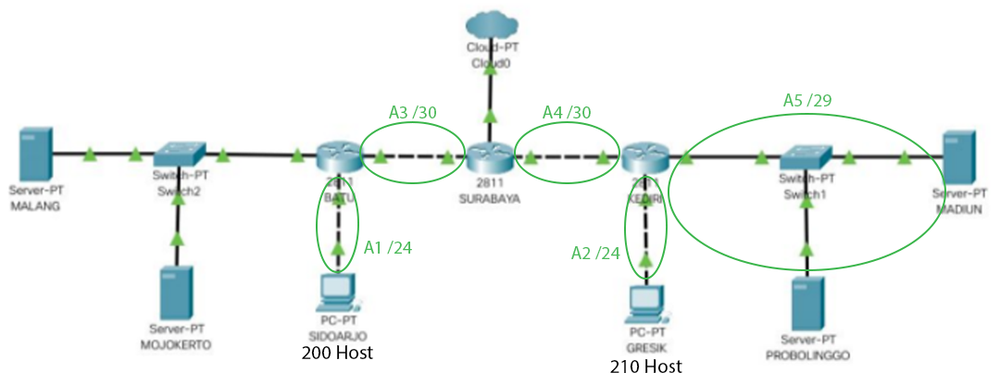
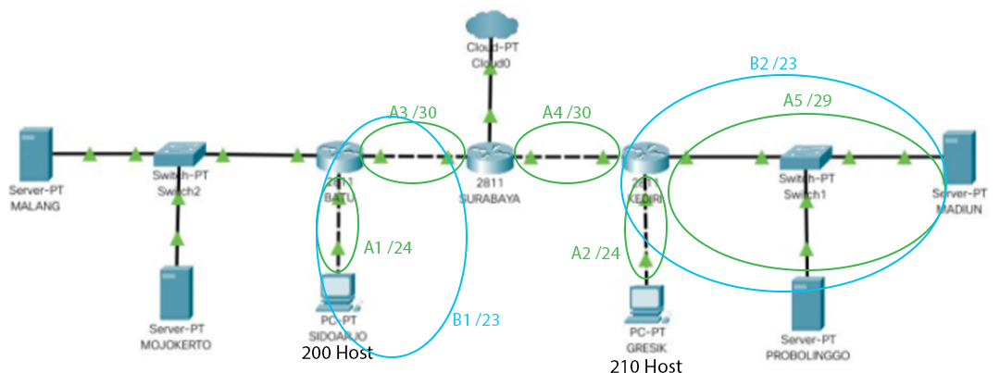
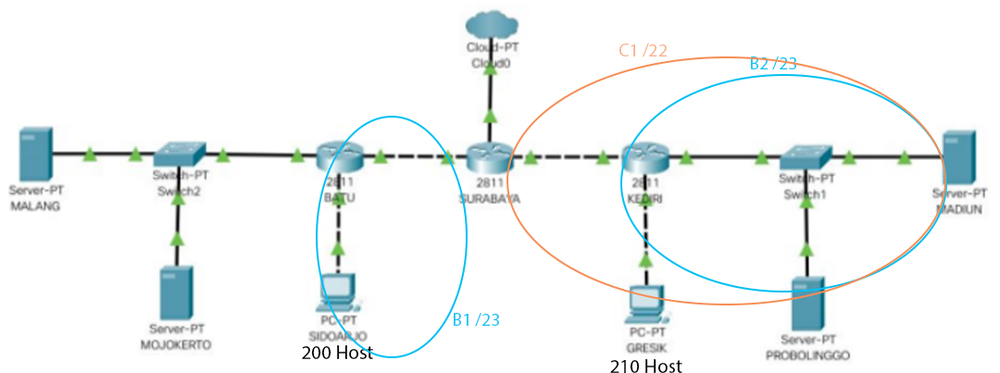
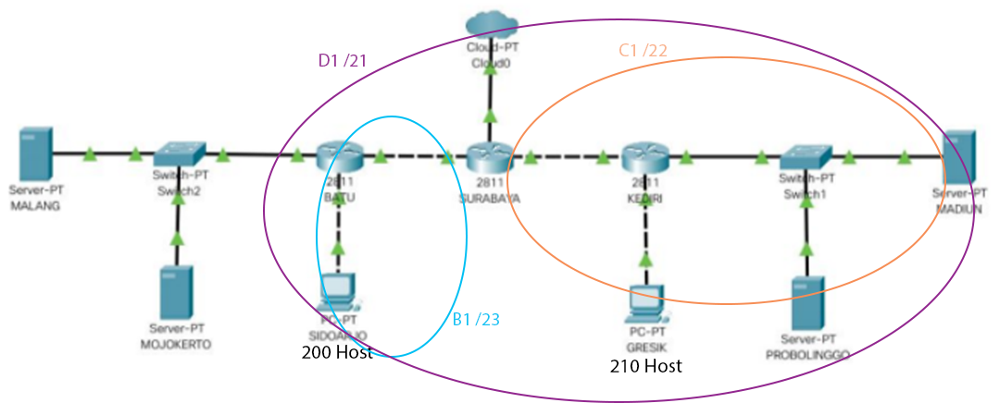
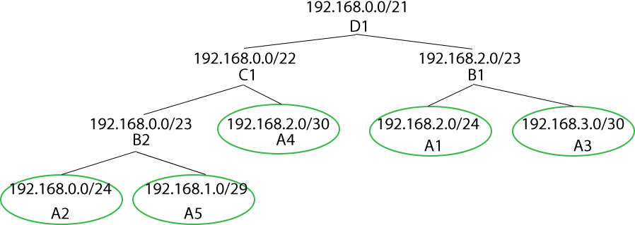

# Laporan Resmi Modul 5

## Topologi

```
# Switch
uml_switch -unix switch0 > /dev/null < /dev/null &	//surabaya-kediri
uml_switch -unix switch1 > /dev/null < /dev/null &	//kediri-madiun-probolinggo
uml_switch -unix switch2 > /dev/null < /dev/null &	//batu-malang-mojokerto
uml_switch -unix switch3 > /dev/null < /dev/null &	//surabaya-batu
uml_switch -unix switch4 > /dev/null < /dev/null &	//kediri-gresik
uml_switch -unix switch5 > /dev/null < /dev/null &	//batu-sidoarjo

# Router
xterm -T SURABAYA -e linux ubd0=SURABAYA,jarkom umid=SURABAYA eth0=tuntap,,,10.151.70.29 eth1=daemon,,,switch0 eth2=daemon,,,switch3 mem=96M &
xterm -T BATU -e linux ubd0=BATU,jarkom umid=BATU eth0=daemon,,,switch3 eth1=daemon,,,switch2 eth2=daemon,,,switch5 mem=96M &
xterm -T KEDIRI -e linux ubd0=KEDIRI,jarkom umid=KEDIRI eth0=daemon,,,switch0 eth1=daemon,,,switch1 eth2=daemon,,,switch4 mem=96M &

# Server
xterm -T PROBOLINGGO -e linux ubd0=PROBOLINGGO,jarkom umid=PROBOLINGGO eth0=daemon,,,switch1 mem=128M &
xterm -T MADIUN -e linux ubd0=MADIUN,jarkom umid=MADIUN eth0=daemon,,,switch1 mem=128M &
xterm -T MALANG -e linux ubd0=MALANG,jarkom umid=MALANG eth0=daemon,,,switch2 mem=128M &
xterm -T MOJOKERTO -e linux ubd0=MOJOKERTO,jarkom umid=MOJOKERTO eth0=daemon,,,switch2 mem=128M &

# Client
xterm -T GRESIK -e linux ubd0=GRESIK,jarkom umid=GRESIK eth0=daemon,,,switch4 mem=96M &
xterm -T SIDOARJO -e linux ubd0=SIDOARJO,jarkom umid=SIDOARJO eth0=daemon,,,switch5 mem=96M &
```

## Subnetting

Subnetting dilakukan menggunakan pendekatan **CIDR**. 


##### Subnet kelas A



##### Subnet kelas B



##### Subnet kelas C



##### Subnet kelas D



### Pembagian IP



\
DNS Server **MALANG** dan DHCP Server **MOJOKERTO** tidak diikutsertakan dalam Subnetting dan pembagian alamat IP karena sudah mendapatkan IP dari IP DMZ.

|Subnet|Anggota|IP|Netmask
|-|-|-|-|
|A1|Batu|192.168.2.1|255.255.255.0|
||Sidoarjo|192.168.2.2|255.255.255.0|
|A2|Kediri|192.168.0.1|255.255.255.0|
||Gresik|192.168.0.2|255.255.255.0|
|A3|Surabaya|192.168.3.1|255.255.255.252|
||Batu|192.168.3.2|255.255.255.252|
|A4|Surabaya|192.168.2.1|255.255.255.252|
||Kediri|192.168.2.2|255.255.255.252|
|A5|Kediri|192.168.1.1|255.255.255.248|
||Probolinggo|192.168.1.2|255.255.255.248|
||Madiun|192.168.1.3|255.255.255.248|
|DMZ|Malang|10.151.71.58|255.255.255.248|
||Mojokerto|10.151.71.59|255.255.255.248|

## Setup Interface

### Router

* **SURABAYA**
    ```
    auto lo
    iface lo inet loopback

    auto eth0
    iface eth0 inet static
    address 10.151.70.30
    netmask 255.255.255.252
    gateway 10.151.70.29

    #switch0
    auto eth1
    iface eth1 inet static
    address 192.168.2.1
    netmask 255.255.255.252

    #switch3
    auto eth2
    iface eth2 inet static
    address 192.168.3.1
    netmask 255.255.255.252
    ```

* **BATU**
    ```
    auto lo
    iface lo inet loopback

    #switch3
    auto eth0
    iface eth0 inet static
    address 192.168.3.2
    netmask 255.255.255.252
    gateway 192.168.3.1

    #switch2
    auto eth1
    iface eth1 inet static
    address 10.151.71.57
    netmask 255.255.255.248

    #switch5
    auto eth2
    iface eth2 inet static
    address 192.168.2.1
    netmask 255.255.255.0
    ```

* **KEDIRI**
    ```
    auto lo
    iface lo inet loopback

    #switch0
    auto eth0
    iface eth0 inet static
    address 192.168.2.2
    netmask 255.255.255.252
    gateway 192.168.2.1

    #switch1
    auto eth1
    iface eth1 inet static
    address 192.168.1.1
    netmask 255.255.255.248

    #switch4
    auto eth2
    iface eth2 inet static
    address 192.168.0.1
    netmask 255.255.255.0
    ```
### Server

* **MALANG**
    ```
    auto lo
    iface lo inet loopback

    #switch2
    auto eth0
    iface eth0 inet static
    address 10.151.71.58
    netmask 255.255.255.248
    gateway 10.151.71.57
    ```
* **MOJOKERTO**
    ```
    auto lo
    iface lo inet loopback

    #switch2
    auto eth0
    iface eth0 inet static
    address 10.151.71.59
    netmask 255.255.255.248
    gateway 10.151.71.57
    ```
* **PROBOLINGGO**
    ```
    auto lo
    iface lo inet loopback

    #switch1
    auto eth0
    iface eth0 inet static
    address 192.168.1.2
    netmask 255.255.255.248
    gateway 192.168.1.1
    ```
* **MADIUN**
    ```
    auto lo
    iface lo inet loopback

    #switch1
    auto eth0
    iface eth0 inet static
    address 192.168.1.3
    netmask 255.255.255.248
    gateway 192.168.1.1
    ```

### Client

* **SIDOARJO**
    ```
    auto lo
    iface lo inet loopback

    #switch5
    auto eth0
    iface eth0 inet static
    address 192.168.2.2
    netmask 255.255.255.0
    gateway 192.168.2.1
    ```
* **GRESIK**
    ```
    auto lo
    iface lo inet loopback

    #switch4
    auto eth0
    iface eth0 inet static
    address 192.168.0.2
    netmask 255.255.255.0
    gateway 192.168.0.1
    ```
## Routing

##### Routing di SURABAYA
```
ip route add 10.151.71.56/29 via 192.168.3.2    #malang-mojokerto
ip route add 192.168.2.0/24 via 192.168.3.2     #a1(sidoarjo)
ip route add 192.168.0.0/24 via 192.168.2.2     #a2(gresik)
ip route add 192.168.1.0/24 via 192.168.2.2     #a5(madiun-probolinggo)
```

## Setup DHCP Server

***

## Soal

##### Soal 1: Akses keluar tanpa MASQUERADE di SURABAYA

Command di **SURABAYA**:
```
iptables -t nat -A POSTROUTING -o eth0 -j SNAT -s 192.168.0.0/16 --to-source 10.151.70.30
```

##### Soal 2: Drop semua akses SSH dari luar Topologi ke DHCP Server dan DNS Server di SURABAYA

Command di **SURABAYA**:
```
iptables -A FORWARD -d 10.151.71.56/29 -i eth0 -p tcp --dport 22 -j DROP
```

##### Soal 3: Maksimal 3 koneksi ICMP secara bersamaan pada DHCP dan DNS Server
Command di **MALANG** dan **MOJOKERTO**:
```
iptables -A INPUT -p icmp -m connlimit --connlimit-above 3 --connlimit-mask 0 -j DROP
```

##### Soal 4: Batas akses MALANG dari SIDOARJO (Senin - Jumat; 07:00 - 17:00)
Command di **MALANG**
```
iptables -A INPUT -s 192.168.2.0/24 -d 10.151.71.58/29 -m time --timestart 07:00 --timestop 17:00 --weekdays Mon,Tue,Wed,Thu,Fri -j ACCEPT

iptables -A INPUT -s 192.168.2.0/24 -j REJECT
```

##### Soal 5: Batas akses MALANG dari GRESIK (setiap hari; 17:00 - 07:00)
Command di **MALANG**:
```
iptables -A INPUT -s 192.168.0.0/24 -m time --timestart 07:00 --timestop 17:00 -j REJECT
```

##### Soal 6: Client akses DNS Server didistribusikan ke PROBOLINGGO port 80 dan MADIUN port 80 secara bergantian
Command di **SURABAYA**
```
iptables -A PREROUTING -t nat -p tcp -d 10.151.71.58 -m statistic --mode nth --every 2 --packet 0 -j DNAT --to-destination 192.168.1.2:80

iptables -A PREROUTING -t nat -p tcp -d 10.151.71.58 -j DNAT --to-destination 192.168.1.3:80
```

##### Soal 7: Log paket-paket yang di-*drop*

Command di topologi yang memiliki *rule* **DROP** (**SURABAYA**, **MALANG**, **MOJOKERTO**):
```
iptables -N LOGGING
iptables -A INPUT -j LOGGING
iptables -A OUTPUT -j LOGGING
iptables -A LOGGING -j LOG --log-prefix "IPTables-Dropped: " --log-level 4
iptables -A LOGGING -j DROP
```